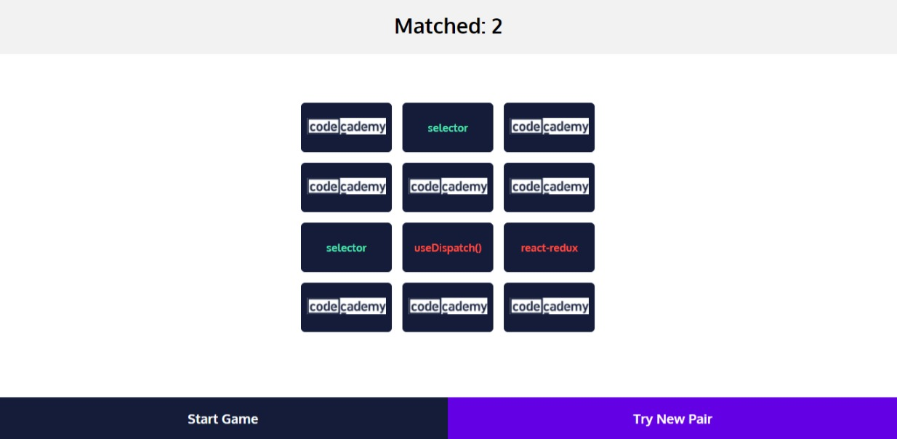

# Matching Memory

A matching game to explore state management with react-redux

## Screenshot

## Technology Used

- HTML
- CSS
- JavaScript (ReactJs)
- React-redux

## Source

&copy; [Codecademy.com](https://codecademy.com) 2022.
